# IAS-Processor-Assembler-Implementation-Project-in-Python

# 🖥️ IAS Architecture Implementation

A comprehensive implementation of the IAS (Institute for Advanced Study) computer architecture, featuring a quadratic equation solver with custom instruction support.

## 🎯 Overview

This project implements a software simulation of the IAS architecture, enhanced with specialized instructions for solving quadratic equations. The system consists of three main components:
- A modern 40-bit floating-point implementation
- An assembler that translates IAS assembly to machine code
- A processor simulator that executes the machine code

## ⚡ Key Features

### Custom Instructions
- **DISC** (Discriminant): Computes `b² - 4ac`
- **SQRT** (Square Root): Calculates square root using hardware acceleration

### Memory Architecture
- 40-bit word length
- Floating-point representation:
  - 1 bit sign
  - 8 bits exponent
  - 31 bits mantissa

### Input/Output
- Interactive command-line interface
- Real-time register state visualization
- Color-coded output for better readability

## 🔍 Implementation Details

### Floating-Point System
```python
[ S | EEEEEEEE | MMMMMMMMMMMMMMMMMMMMMMMMMMMMMMM ]
  39    38-31                  30-0
```
- Sign bit (Position 39)
- Exponent field (Positions 31-38)
- Mantissa field (Positions 0-30)

### Instruction Cycle
1. Fetch instruction from memory
2. Decode left and right instructions
3. Execute operations sequentially
4. Update processor state

### Memory Layout
The IAS machine utilizes 10 memory locations (M[0] to M[9]) carefully organized for quadratic equation solving:

| Location | Symbol  | Purpose                                    | Formula/Value          |
|----------|---------|--------------------------------------------|-----------------------|
| M[0]     | a       | First coefficient                          | From x² term          |
| M[1]     | b       | Second coefficient                         | From x term           |
| M[2]     | c       | Third coefficient                          | Constant term         |
| M[3]     | a_2     | Denominator for root calculation          | 2 × a                 |
| M[4]     | dis     | Discriminant                              | b² - 4ac              |
| M[5]     | 4       | Constant for discriminant calculation     | Fixed value: 4        |
| M[6]     | 2       | Constant for denominator calculation      | Fixed value: 2        |
| M[7]     | root_d  | Square root of discriminant               | √(b² - 4ac)          |
| M[8]     | x1      | First root                                | (-b + √dis)/(2a)     |
| M[9]     | x2      | Second root                               | (-b - √dis)/(2a)     |

```mermaid
graph TD
    A[Input: a,b,c] --> B[Calculate 2a]
    A --> C[Calculate Discriminant]
    C --> D{Check if dis ≥ 0}
    D -->|Yes| E[Calculate √dis]
    E --> F[Calculate Roots]
    D -->|No| G[No Real Roots]
```



## 🚀 Running the Project

1. Ensure Python 3.x is installed
2. Install required dependencies:
   ```bash
   pip install colorama rich
   ```
3. Run the processor:
   ```bash
   python BT2024038_IAS_Processor.py
   ```

## 📝 Usage Example

```
Enter coefficients (-15 ≤ a, b, c ≤ 15 AND a ≠ 0):
a: 1
b: -5
c: 6

Please type the IAS commands:
DISC M(0),M(1),M(2)
STOR M(4)
JUMP+ M(500,0:19)
HALT
SQRT M(4) STOR M(7)
LOAD MQ,M(0)
MUL M(6) LOAD MQ
STOR M(3)
LOAD -M(1) ADD M(7)
DIV M(3) LOAD MQ
STOR M(8)
LOAD -M(1) SUB M(7)
DIV M(3) LOAD MQ
STOR M(9)
EXIT

Results:
The roots are 3.0 and 2.0
```

## 🔧 Technical Components

### Processor (`BT2024038_IAS_Processor.py`)
- Implements the main instruction cycle
- Manages registers and memory
- Handles I/O and display

### Assembler (`BT2024038_IAS_Assembler.py`)
- Converts assembly to machine code
- Supports custom instruction set
- Provides binary encoding

### Floating-Point (`BT2024038_IAS_FloatingPoint.py`)
- Custom 40-bit floating-point implementation
- IEEE-754 style representation
- Supports basic arithmetic operations

## 🎨 Visual Features

- Color-coded output using `colorama`
- Styled boxes for results using `rich`
- Real-time register state display

## 📸 Demo
[!Demo](https://github.com/user-attachments/assets/7b0c7482-b9cb-461e-9964-b2b39b74d13f)

## 🤝 Contributing

Feel free to submit issues and enhancement requests!

## 📜 License

This project is licensed under the Apache 2.0 License - see the LICENSE file for details.

## 🙏 Acknowledgments

- Based on the original IAS computer design by von Neumann
- Enhanced with modern floating-point capabilities
- Optimized for educational purposes

